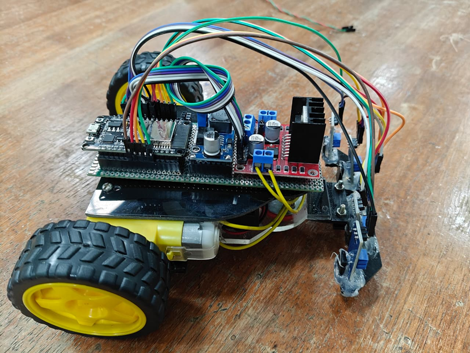
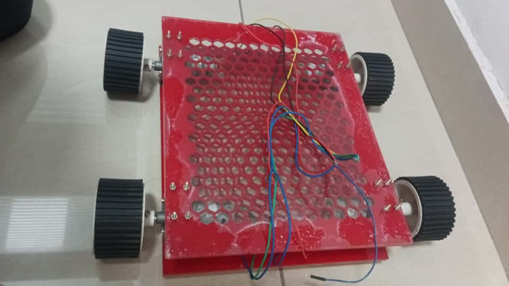
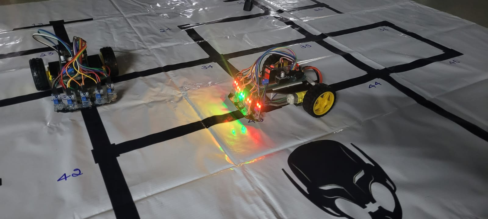

# Industrial Automated Line Follower Robot

> A cost-effective, autonomous multi-robot system for warehouse material transport — built with ESP32, a modified Dijkstra's algorithm, and real-time obstacle avoidance. Designed for Small and Medium-sized Enterprises (SMEs) at under ₹10,000 per unit.

---

## Demo
| Working prototype - video below - click to view |
|---|
[](https://www.youtube.com/watch?v=BhsLwuRQVgU)

| Small-Scale Prototype | Medium-Scale (Honeycomb Chassis) | prototype on map |
|---|---|---|
|  |  |  |

---

## Overview

Traditional line-following robots are cheap but rigid — they can't handle dynamic environments, detect obstacles intelligently, or coordinate with other robots. Commercial Autonomous Mobile Robots (AMRs) solve this but cost lakhs of rupees, putting them out of reach for small warehouses.

This project bridges that gap. It delivers **AMR-level intelligence** (dynamic pathfinding, obstacle re-routing, multi-robot coordination) at the **cost of a basic AGV** — making smart warehouse automation accessible to SMEs, textile units, electronics assembly shops, and small production lines.

**Key highlights:**
- Modified Dijkstra's algorithm running onboard the ESP32 — no preloaded map needed at runtime
- Dynamic re-routing — robot autonomously detours around obstacles instead of stopping
- Wi-Fi based central server for multi-robot job scheduling and traffic control
- Custom honeycomb acrylic chassis for industrial-grade weight distribution
- Full Bill of Materials (BOM) under ₹10,000 per robot

---

## System Architecture

```
┌─────────────────────────────────────┐
│        Central Coordination Server  │
│  - Job Scheduling & Allocation      │
│  - Robot Position Tracking          │
│  - Predictive Collision Avoidance   │
│  - Map / Node Graph Store           │
└────────────────┬────────────────────┘
                 │ Wi-Fi (TCP/IP)
                 ▼
┌─────────────────────────────────────┐
│              Robot (ESP32)          │
│                                     │
│  ┌──────────┐  ┌──────────────────┐ │
│  │ Onboard  │  │  Perception Layer│ │
│  │Processing│  │  - 5-ch IR Array │ │
│  │ Dijkstra │  │  - 3x HC-SR04    │ │
│  │ State    │  │    Ultrasonic    │ │
│  │ Machine  │  └──────────────────┘ │
│  └────┬─────┘                       │
│       ▼                             │
│  ┌──────────┐                       │
│  │  Motion  │                       │
│  │  Layer   │                       │
│  │ BTS-7960 │                       │
│  │ 150RPM   │                       │
│  │ Motors   │                       │
│  └──────────┘                       │
└─────────────────────────────────────┘
```

The server handles high-level job scheduling. Each robot independently calculates its own path using onboard Dijkstra's — keeping the system responsive and reducing server load.

---

## Tech Stack

| Layer | Technology |
|---|---|
| Microcontroller | ESP32 (Dual-core Tensilica LX6, integrated Wi-Fi/BT) |
| Firmware Language | MicroPython |
| IDE | Thonny |
| Path Planning | Modified Dijkstra's Algorithm (single robot), A* (multi-robot) |
| Motor Control | PID Controller + BTS-7960 H-Bridge Driver |
| Line Detection | TCRT5000 5-Channel IR Sensor Array |
| Obstacle Detection | HC-SR04 Ultrasonic Sensors (front, left, right) |
| Communication | TCP/IP over Wi-Fi |
| Power | 11.1V 2200mAh LiPo Battery |
| Chassis | Custom laser-cut acrylic honeycomb design |

---

## Hardware Components

| Component | Specification | Cost (approx.) |
|---|---|---|
| ESP32 Microcontroller | Dual-core, Wi-Fi + BT, 520KB SRAM | ₹300–400 |
| TCRT5000 IR Sensor Array (5ch) | 5V, OUT1–OUT5 digital output | ₹150–180 |
| DC Motors with Encoders | 150 RPM, closed-loop feedback | ₹600–1000 each |
| HC-SR04 Ultrasonic Sensors | 5V, 2cm–400cm range, 40kHz | ₹50–70 each |
| BTS-7960 Motor Driver | 43A max, 6V–27V, PWM up to 25kHz | ₹250–300 |
| LiPo Battery | 11.1V, 2200mAh | ₹1200–2000 |
| Honeycomb Acrylic Chassis | Custom laser-cut, dual-layer | ₹750–1150 |
| **Total (estimated)** | | **< ₹10,000** |

---

## Algorithm — Modified Dijkstra's

The warehouse layout is stored as a **node graph** in the ESP32's flash memory. Each intersection or pickup point is a named node (`N1`, `N2`, ...).

```
graph = {
  'N1': {'N2': 1, 'N3': 1},
  'N2': {'N1': 1, 'N4': 1},
  ...
}
```

When a job is received (e.g., *"Go to Node G"*), the algorithm:

1. Runs Dijkstra's on the graph from the current node to the destination
2. Returns the shortest node sequence: `N1 → N3 → N6 → G`
3. A `get_command()` helper translates this into robot instructions: `['S', 'L', 'S', 'R']`
4. The State Machine executes these one at a time, using IR junctions as triggers

**Dynamic Re-routing:** If an obstacle is detected mid-path, the robot pauses, marks the blocked edge, and re-runs Dijkstra's to find an alternate route — all onboard, without contacting the server.

---

## 🔁 Robot State Machine

```
              ┌─────────────┐
   (default)  │LINE_FOLLOWING│ ◄──────────────────┐
              └──────┬───────┘                    │
                     │ IR reads '11111'            │
                     ▼ (junction detected)         │
              ┌─────────────┐                     │
              │NODE_DETECTED│                     │
              └──────┬───────┘                    │
                     │ Execute next command        │
                     │ (S / L / R / U)            │
                     └────────────────────────────┘
                     
              ┌──────────────────┐
              │OBSTACLE_DETECTED │ ← Range sensor < threshold
              └────────┬─────────┘
                       │ Re-run Dijkstra's
                       │ Calculate detour
                       └──► Resume LINE_FOLLOWING
```

---

## 💬 Source Code

The firmware and server-side source code for this project are proprietary to the development team and are not publicly available. For technical discussions, collaboration enquiries, or further information, feel free to reach out via LinkedIn or email.

---

## ✅ Testing Results

| Test | What Was Validated | Result |
|---|---|---|
| Drivetrain | Motors, encoders, BTS-7960 at 50% & 100% PWM | ✅ Pass |
| IR Sensors | Binary output on line, white surface, junctions | ✅ Pass |
| Ultrasonic | Distance accuracy at 10cm, 50cm, 100cm | ✅ Pass |
| Dijkstra's | Correct shortest path on test graph | ✅ Pass |
| Line Following | Smooth tracking on curves + straights | ✅ Pass |
| Node Handling | Correct turn execution at junctions | ✅ Pass |
| Full Mission | Job reception → path calc → destination | ✅ Pass |
| Dynamic Re-routing | Obstacle mid-path → detour → destination | ✅ Pass |
| Battery Life | Continuous operation on 2200mAh LiPo | ✅ 3+ hours |
| Cost Constraint | Total BOM under ₹10,000 | ✅ Pass |

---

## 🔮 Future Work

- **Computer Vision** — ESP32-CAM for QR-code-based node detection, removing dependency on floor lines
- **Mesh Networking** — Vehicle-to-vehicle communication for direct right-of-way negotiation between robots
- **AI-enhanced Navigation** — Reinforcement learning for adaptive path decisions in unfamiliar layouts
- **Auto-docking** — Autonomous battery charging stations
- **Digital Twin Dashboard** — Real-time fleet monitoring and visualization

---

## 📄 License

This project is open for academic and personal use. See [LICENSE](LICENSE) for details.

---

## 🙏 Acknowledgements

Developed as a final-year project at the **Department of Information Science & Engineering, MIT Mysore (2025–26)**.

> *Bridging the automation gap for small-scale industry — one warehouse at a time.*
